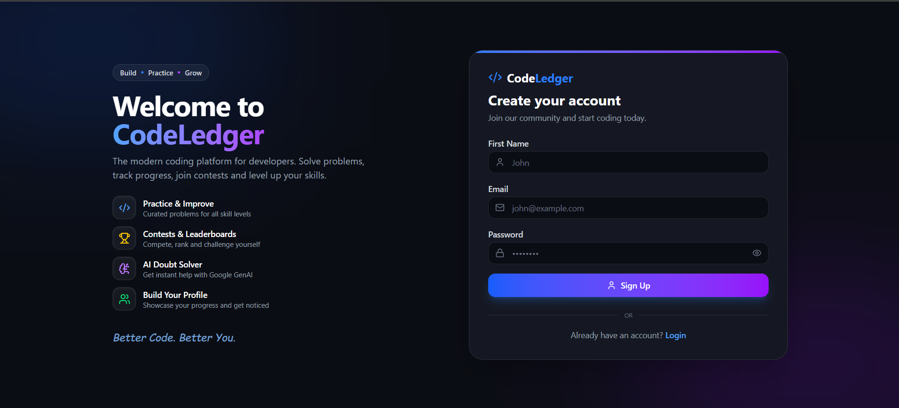
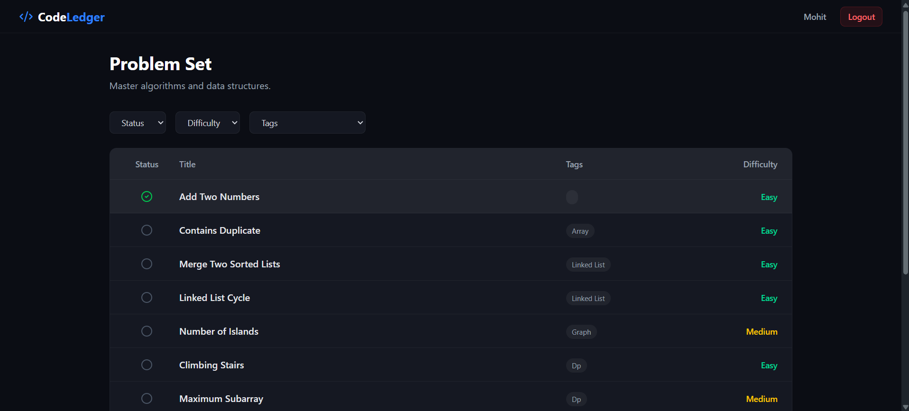
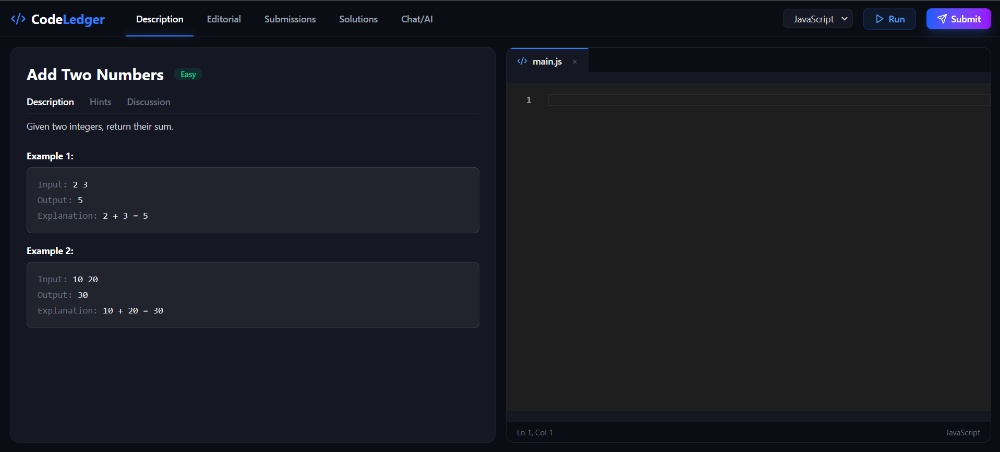

## 🚀 About The Project

**CodeLedger** is a modern, full-stack competitive programming and coding platform. It provides a seamless coding environment with integrated code execution, AI-powered doubt solving, and video editorials. Built to handle complex state, secure authentication, and seamless third-party API integrations, it provides developers with a sleek workspace to practice data structures and algorithms.

### ✨ Key Features

* **💻 Interactive Code Workspace:** Write, run, and submit code in C++, Java, and JavaScript using the Monaco Editor (VS Code's core editor).
* **⚡ Live Code Execution:** Integrated with the Judge0 API for secure and fast code compilation, returning detailed runtime, memory usage, and test case validations.
* **🤖 AI ChatBot Assistant:** Stuck on a problem? Ask the integrated Gemini AI chatbot for step-by-step hints, approach suggestions, and time complexity analysis without revealing the exact solution.
* **🛡️ Admin Dashboard:** A dedicated, secure admin panel to create, update, and delete problems, manage test cases (hidden and visible), and upload solution videos.
* **🎥 Video Editorials:** Built-in video player for problem editorials, powered by Cloudinary for optimized streaming.
* **📊 Submission Tracking:** Track your submission history, past code, test cases passed, and execution metrics.
* **🔐 Secure Authentication:** JWT-based authentication with Redis caching for secure session management and instant logout token blacklisting.

---

## 🛠️ Tech Stack

### Frontend
* **React.js** (Vite)
* **Tailwind CSS & DaisyUI**
* **Redux Toolkit** (State Management)
* **React Router DOM**
* **Monaco Editor** (`@monaco-editor/react`)

### Backend
* **Node.js & Express.js**
* **MongoDB & Mongoose** (Database)
* **Redis** (Token Blacklisting & Session Security)
* **JWT** (Authentication) & **Bcrypt** (Password Hashing)

### Cloud & External APIs
* **Judge0 API:** Code compilation and execution.
* **Google Gemini AI API:** Context-aware problem-solving assistant.
* **Cloudinary:** Video upload and delivery network.

---

## 📸 Sneak Peek







---

## ⚙️ Local Installation & Environment Variables

To run this project locally, clone the repository and add the following environment variables to your respective `.env` files.

### 1. Backend Setup
```bash
cd backend
npm install
```
Create a `.env` file in the `/backend` directory:
```env
PORT=3000
DB_CONNECT_STRING=your_mongodb_connection_string
JWT_KEY=your_jwt_secret_key
REDIS_PASS=your_redis_cloud_password
JUDGE0_KEY=your_rapidapi_judge0_key
GEMINI_KEY=your_google_gemini_api_key
CLOUDINARY_CLOUD_NAME=your_cloudinary_cloud_name
CLOUDINARY_API_KEY=your_cloudinary_api_key
CLOUDINARY_API_SECRET=your_cloudinary_api_secret
```
Start the backend server:
```bash
npm run dev
```

### 2. Frontend Setup
```bash
cd ../frontend
npm install
```
Create a `.env` file in the `/frontend` directory:
```env
VITE_API_URL=http://localhost:3000
```
Start the React development server:
```bash
npm run dev
```

---

## 📈 What I Learned

Building CodeLedger was a massive technical undertaking that significantly leveled up my skills:
- **System Architecture:** Learned how to decouple frontend and backend safely, especially when handling user-submitted code and securely forwarding it to compilation engines (Judge0).
- **Advanced Security:** Implemented Redis for token blacklisting, ensuring immediate and secure session invalidation upon logout.
- **AI Integration:** Mastered prompting and context-injection for LLMs, ensuring the Gemini API responded strictly as a DSA tutor rather than a generic assistant.
- **UI Engineering:** Gained deep experience in building complex, interactive layouts (split panes, real-time consoles, and terminal-like outputs).

---

## 🤝 Let's Connect!

I am actively looking for **Software Engineering roles**. If you are a recruiter or an engineering manager looking for a developer who can design robust full-stack applications and adapt to complex integrations quickly, let's talk!

* **LinkedIn:** [www.linkedin.com/in/mohit-agrawal-819496317]
* **Email:** [mohitagrawal2212@gmail.com]

<p align="center">
  <i>If you like this project, please consider giving it a ⭐!</i>
</p>
